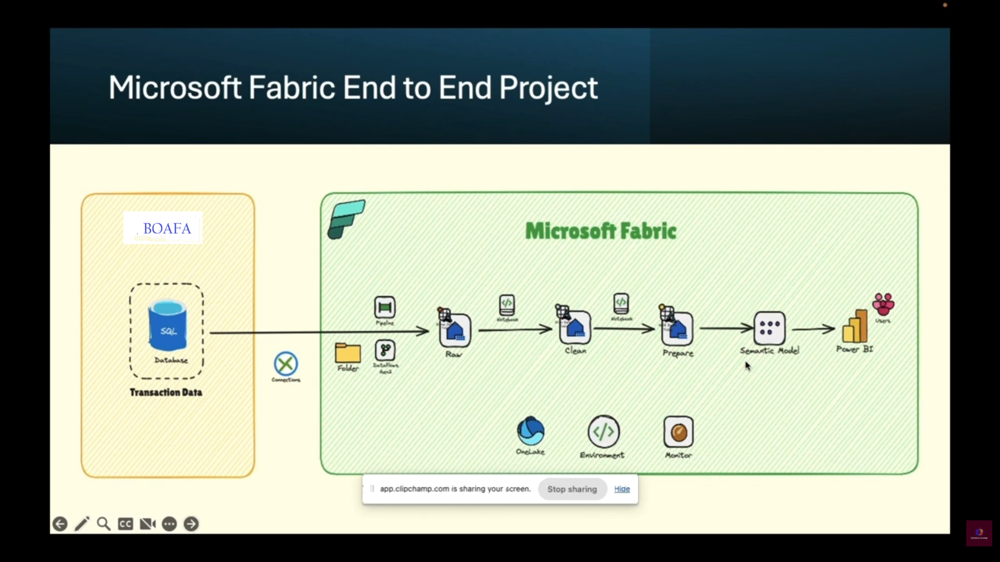

# Understand-medallion-lakehouse-architecture-for-Fabric-with-OneLake
# 1.Project OverView
# 2.Setup and Config table
# 3.File to raw and Logging Framework
# 4.Raw to clean and DQ Framework
# 5.Clean to prepare
# 6.Pipline development
# 7.Semantic Model and Power Bi

## 
